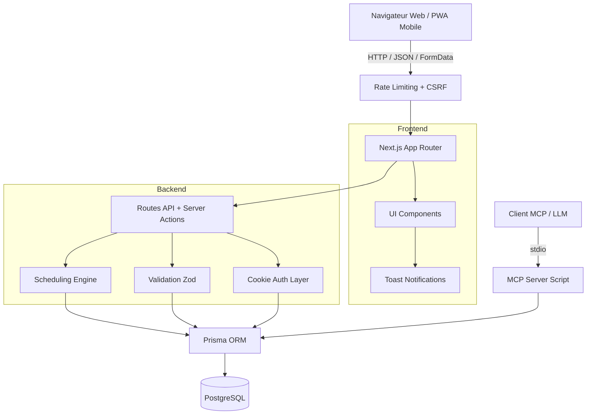

<div align="center">

# Quotidy

**L'app qui répartit les tâches et l'épargne du foyer, équitablement et sans friction.**

Récurrences automatiques, rotation équitable entre membres, épargne partagée, dashboard mobile-first, PWA installable, self-hostable en Docker.

[](https://nextjs.org)
[](https://react.dev)
[](https://www.typescriptlang.org)
[](https://www.prisma.io)
[](https://www.postgresql.org)
[](#tests)

</div>

---

## Ce que fait Quotidy

- **Tâches récurrentes** — `daily`, `every_x_days`, `weekly`, `every_x_weeks`, `monthly_simple`, avec glissement intelligent (Sliding Window)
- **Attribution équitable** — `fixed`, `manual`, `strict_alternation`, `round_robin`, `least_assigned_count`, `least_assigned_minutes`
- **Épargne & Budget** — Cagnottes partagées, virements, formules de calcul intelligentes (Calculators) et auto-fill conditionnel
- **Sessions focus** chronométrées par pièce
- **Calendrier mensuel** filtrable par membre + vue agenda 7 jours sur mobile
- **Vacances** — chaque membre peut s'absenter, les tâches glissent automatiquement
- **Streaks et statistiques** d'équité par foyer
- **Multi-foyers** par utilisateur
- **Export iCal** par foyer ou par membre
- **PWA** installable avec notifications web push
- **MCP server** intégré pour piloter l'app depuis un assistant IA

## Stack

| Couche | Tech |
|---|---|
| Frontend | Next.js 16 (App Router), React 19, Tailwind 4 |
| Backend | Routes Next.js, Prisma 6, PostgreSQL |
| Auth | Sessions cookie HTTPOnly |
| Tests | Vitest 4 (unit) |
| Déploiement | Docker Compose, systemd timers, cron local |

### Architecture



## Démarrage rapide

```bash
git clone https://github.com/CesarPierr/quotidy.git
cd quotidy
cp .env.example .env
npm install
docker compose up -d db
npx prisma generate
npx prisma db push
npm run dev
```

App : <http://localhost:3000>

### Première connexion

1. Créez un compte (email / mot de passe)
2. Suivez l'onboarding pour créer votre foyer, ajouter quelques tâches et inviter les membres
3. La visite guidée présente les 3 panneaux principaux : **Aujourd'hui**, **Planifier**, **Réglages**

## Tests

```bash
npm run lint         # ESLint
npm run typecheck    # TypeScript strict
npm run test         # Vitest (unit + couverture)
```

## Structure

```
src/
  app/                 routes Next.js (App Router)
    app/               UI authentifiée
    api/               endpoints JSON
  components/          composants React groupés par domaine:
    tasks/             gestion et création de tâches
    calendar/          vues mensuelles et synchro
    dashboard/         widgets de la page d'accueil
    settings/          vues de configuration
    savings/           module d'épargne et calculatrices
    layout/            app-shell, headers
    shared/            utilitaires (formulaires, thèmes)
    ui/                primitives Radix/Tailwind
  lib/
    scheduling/        moteur de récurrence et d'attribution
    analytics.ts       streaks et équité
    auth.ts, db.ts     auth et accès DB
prisma/                schéma + migrations + seeds
public/                manifest, sw.js, icônes PWA
scripts/               CI, MCP server, déploiement
tests/                 Vitest unit tests
docs/                  guides setup, prod, reverse proxy
```

## Déploiement

| Cible | Commande |
|---|---|
| Local prod (Docker) | `npm run deploy:local-prod` |
| Sync vers serveur SSH | `npm run deploy:server-sync user@host` |
| Auto-update local (cron) | `npm run deploy:install-local-cron` |
| Auto-update serveur | unités `deploy/systemd/*.service` + `*.timer` |

Guides détaillés :

- [docs/setup-dev.md](docs/setup-dev.md)
- [docs/setup-prod.md](docs/setup-prod.md)
- [docs/env.md](docs/env.md)
- [docs/backup.md](docs/backup.md)
- [docs/reverse-proxy-caddy.md](docs/reverse-proxy-caddy.md)
- [docs/reverse-proxy-nginx.md](docs/reverse-proxy-nginx.md)

## Contribuer

Avant chaque PR :

```bash
npm run lint && npm run typecheck && npm run test
```

Conventions clés (voir [AGENTS.md](AGENTS.md)) :

- Tous les formulaires passent par `useFormAction` ([src/lib/use-form-action.ts](src/lib/use-form-action.ts))
- Toute action utilisateur affiche un `useToast`
- Mobile-first — tester systématiquement à 375×812
- Dates via les helpers de [src/lib/date-input.ts](src/lib/date-input.ts) (jamais `toISOString().split("T")[0]`)
- Validation Zod côté serveur dans [src/lib/validation.ts](src/lib/validation.ts)

## Licence

[PolyForm Noncommercial License 1.0.0](LICENSE) — usage personnel, hobby, recherche, associatif et institutionnel autorisés sans frais. **Toute utilisation commerciale nécessite un accord séparé** avec l'auteur.
