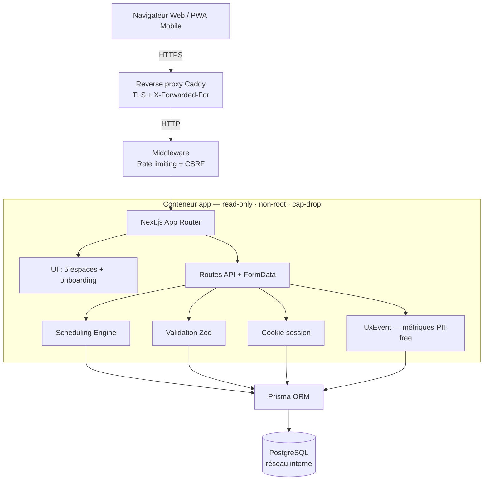

<div align="center">

# Quotidy

**L'app qui répartit les tâches et l'épargne du foyer, équitablement et sans friction.**

Récurrences automatiques, rotation équitable entre membres, épargne partagée, aide-mémoire du foyer, dashboard mobile-first, PWA installable — **self-hostable en Docker**.

[](https://nextjs.org)
[](https://react.dev)
[](https://www.typescriptlang.org)
[](https://www.prisma.io)
[](https://www.postgresql.org)
[](#tests)
[](LICENSE)

</div>

---

## Les cinq espaces

L'app s'organise en cinq espaces autonomes, accessibles depuis l'accueil (grille de lancement) ou la barre latérale sur grand écran :

| Espace | Rôle |
|---|---|
| **Tâches** | Aujourd'hui, calendrier mensuel, routines récurrentes, disponibilités & vacances |
| **Aide-mémoire** | Notes volatiles du foyer (FIFO, purge automatique) + listes/checklists réutilisables |
| **Épargne** | Cagnottes partagées, virements, calculatrices (TVA, formules) et auto-fill conditionnel |
| **Foyer** | Membres, invitations, multi-foyers, journal d'activité, zone sensible |
| **Compte** | Profil, sécurité, sessions, RGPD, notifications & apparence |

## Ce que fait Quotidy

- **Tâches récurrentes** — `daily`, `every_x_days`, `weekly`, `every_x_weeks`, `monthly_simple`, avec glissement intelligent (Sliding Window)
- **Attribution équitable** — `fixed`, `manual`, `strict_alternation`, `round_robin`, `least_assigned_count`, `least_assigned_minutes`
- **Aide-mémoire du foyer** — notes rapides à usage unique (purge configurable) et listes réutilisables (« sac de trek », « affaires chez mamie »…)
- **Épargne & budget** — cagnottes partagées, virements, formules de calcul (Calculators) et auto-fill conditionnel
- **Sessions focus** chronométrées par pièce
- **Calendrier mensuel** filtrable par membre + vue agenda 7 jours sur mobile
- **Vacances & absences** — chaque membre peut s'absenter, les tâches glissent automatiquement
- **Streaks & statistiques** d'équité par foyer
- **Multi-foyers** par utilisateur
- **Export iCal** par foyer ou par membre
- **PWA** installable avec notifications web push
- **Panneau admin** — métriques d'usage agrégées (sans donnée personnelle) et triage des signalements

## Stack

| Couche | Tech |
|---|---|
| Frontend | Next.js 16 (App Router), React 19, Tailwind 4 (config inline dans `globals.css`) |
| Backend | Routes Next.js, Prisma 6, PostgreSQL 17 |
| Auth | Sessions cookie HTTPOnly (table `Session`) |
| Tests | Vitest 4 (unitaire + couverture) |
| Déploiement | Docker Compose durci, reverse proxy Caddy (TLS auto), systemd timers / cron local |

### Architecture



## Démarrage rapide (dev)

```bash
git clone https://github.com/CesarPierr/quotidy.git
cd quotidy
cp .env.example .env
npm install
docker compose up -d db        # PostgreSQL local
npx prisma generate
npx prisma db push
npm run dev
```

App : <http://localhost:3000> · jeu de démo : `npm run db:seed` (`demo@quotidy.local` / `demo12345`).

### Première utilisation

1. Créez un compte (email / mot de passe).
2. L'**onboarding en 3 étapes** (Bienvenue → Profil → Prêt) pré-remplit quelques tâches selon votre type de foyer. Il est entièrement passable, et n'écrit rien en base avant l'étape finale.
3. Naviguez entre les cinq espaces depuis l'**accueil**. Sur mobile, chaque espace propose **Retour** + **Accueil** ; sur desktop, la barre latérale liste tous les espaces.

## Tests

```bash
npm run lint         # ESLint
npm run typecheck    # TypeScript strict
npm run test         # Vitest (unitaire + couverture)
```

**Gate pré-commit** — les trois doivent passer : `npm run lint && npm run typecheck && npm run test`

## Structure

```
src/
  app/
    app/                 UI authentifiée (un dossier par espace)
      taches/            aujourd-hui, calendar, routines, disponibilites
      aide-memoire/      notes du foyer + listes réutilisables
      epargne/           cagnottes & calculatrices
      foyer/             hub matriciel : membres, invitations, foyers, activite, zone-sensible
      compte/            profil, sécurité, RGPD, notifications
      admin/             métriques agrégées + triage signalements
    api/                 endpoints JSON / FormData
    (privacy|terms|contact)/   pages publiques RGPD
  components/            composants React par domaine :
    tasks/  calendar/  savings/  dashboard/  foyer/
    onboarding/          assistant 3 étapes + visite guidée
    layout/  shared/  ui/   app-shell, primitives (bottom-sheet, toast…)
  lib/
    scheduling/          moteur de récurrence et d'attribution (fortement testé)
    analytics.ts         streaks et équité
    admin-stats.ts       agrégats opérateur (PII-free)
    app-sections.ts      source unique des 5 espaces
    auth.ts  db.ts  validation.ts  use-form-action.ts
  middleware.ts          rate limiting + CSRF
prisma/                  schéma + migrations + seeds
public/                  manifest, sw.js, icônes PWA
scripts/                 déploiement (deploy/, server/)
docs/                    guides setup, prod, reverse proxy, sécurité
tests/                   Vitest unit tests
```

## Déploiement

| Cible | Commande |
|---|---|
| Local prod (Docker durci) | `npm run deploy:local-prod` |
| Sync vers serveur SSH | `npm run deploy:server-sync user@host` |
| Auto-update local (cron) | `npm run deploy:install-local-cron` |
| Auto-update serveur | unités `scripts/server/systemd/*.service` + `*.timer` |

Le service applicatif lance `prisma migrate deploy` puis `next start` au démarrage. Recréer uniquement l'app sans rebuild :

```bash
docker compose -f docker-compose.prod.yml --env-file .env.production up -d --no-build --force-recreate app
```

Guides détaillés : [setup-dev](docs/setup-dev.md) · [setup-prod](docs/setup-prod.md) · [env](docs/env.md) · [backup](docs/backup.md) · [Caddy](docs/reverse-proxy-caddy.md) · [Nginx](docs/reverse-proxy-nginx.md)

## Sécurité

Pensée pour exposer un port à Internet sans donner accès au réseau local :

- **Conteneur app durci** — `read_only`, `cap_drop: ALL`, `no-new-privileges`, `tmpfs`, utilisateur non-root, limites mémoire/CPU.
- **Base isolée** sur un réseau Docker `internal` (jamais exposée publiquement).
- **CSRF** double-submit (cookie `__csrf`), **rate limiting** par route, **CSP stricte** dans [next.config.ts](next.config.ts).
- **Reverse proxy Caddy** pour TLS automatique ; `X-Forwarded-For` lu sur l'IP la plus à droite (anti-spoof).
- **Sessions** cookie HTTPOnly, secrets obligatoires (`AUTH_SECRET`, `CSRF_SECRET`, `CRON_SECRET`).
- **Télémétrie sans donnée personnelle** (agrégats), purge automatique au-delà de la fenêtre de rétention.

Checklist de mise en ligne et runbook incident : [docs/beta-readiness.md](docs/beta-readiness.md).

## État du projet

- **Maturité** — bêta self-hosted active. Cible : petits foyers (couple / coloc / famille), ~100 premiers utilisateurs.
- **Modèle** — mono-instance, multi-foyers par compte. Le rate limiter est en mémoire (à externaliser avant le multi-instance).
- **Récent** — refonte de la navigation en 5 espaces, aide-mémoire, onboarding 3 étapes, durcissement sécurité, modernisation UI (épargne, compte, foyer). Voir [CHANGELOG.md](CHANGELOG.md).
- **Suite** — externalisation du rate limiter, enrichissement des statistiques d'équité, notifications plus fines.

## Contribuer

Avant chaque PR : `npm run lint && npm run typecheck && npm run test`.

Conventions clés (détail dans [AGENTS.md](AGENTS.md) et [CONTRIBUTING.md](CONTRIBUTING.md)) :

- Tous les formulaires passent par `useFormAction` ([src/lib/use-form-action.ts](src/lib/use-form-action.ts)).
- Toute action utilisateur affiche un `useToast`.
- Mobile-first — tester systématiquement à 375×812.
- Dates via les helpers de [src/lib/date-input.ts](src/lib/date-input.ts) (jamais `toISOString().split("T")[0]`).
- Validation Zod côté serveur dans [src/lib/validation.ts](src/lib/validation.ts).
- Surfaces sombres via le token `dark:bg-surface` (jamais de hex en dur).

## Licence

[PolyForm Noncommercial License 1.0.0](LICENSE) — usage personnel, hobby, recherche, associatif et institutionnel autorisés sans frais. **Toute utilisation commerciale nécessite un accord séparé** avec l'auteur.
